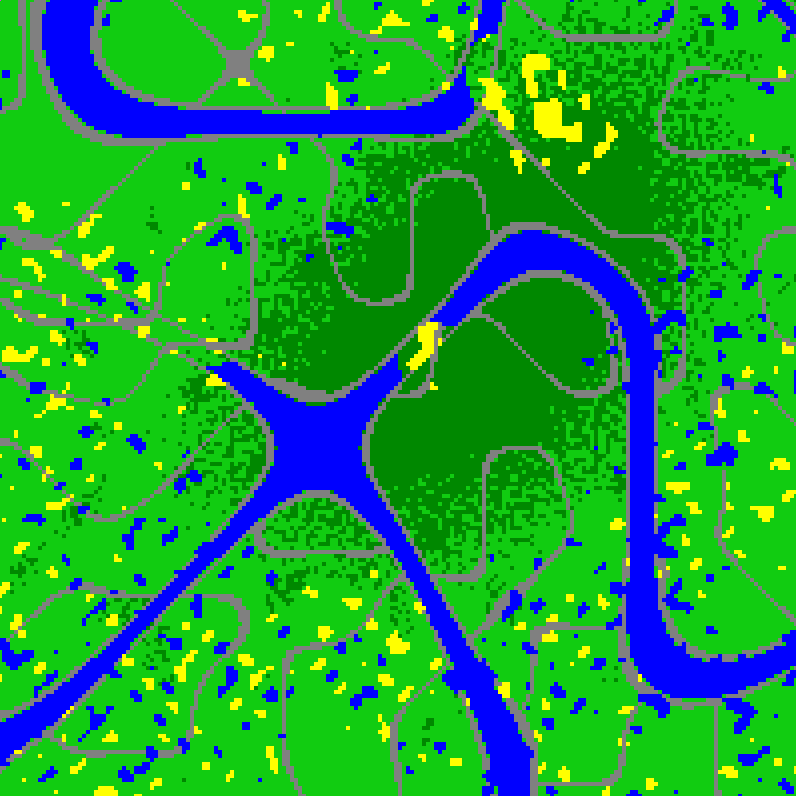

### RPG map generator ###

	(:require [infinitelives.procedural.maps :as maps])
	
	(maps/make-rpg-map w h seed)

Returns a hash-map of `{[x y] terrain}` where terrain is one of `grass`, `trees`, `road`, `sand`, `water`.

